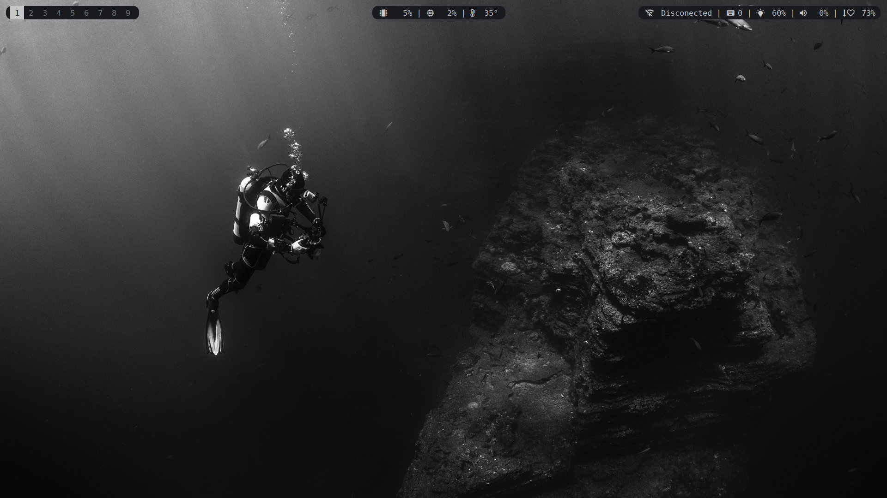
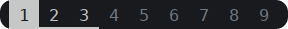
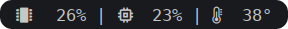
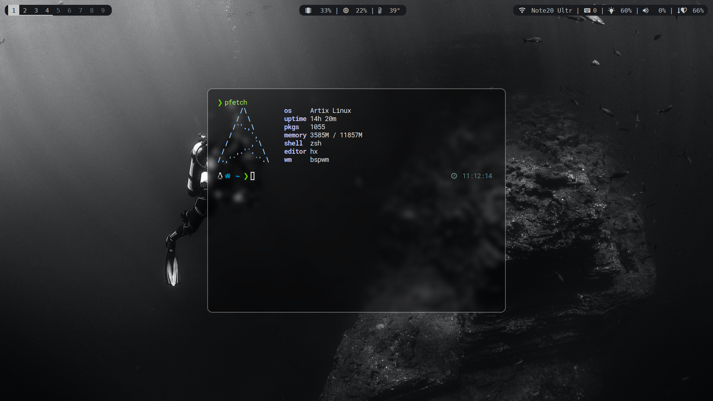
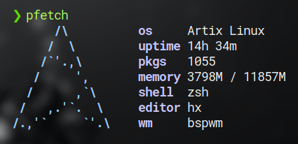

# ⚫ ⚪ Dotfiles - BW Diving Theme ⚫ ⚪



## Table of Contents 📎
- [TODO](#todo) ⭕
- [Required Fonts](#required-fonts) 🗛
- [Polybar](#polybar) 📊
- [Alacritty](#alacritty) 🖵
- [Pfetch](#pfetch) 🖼️
- [Picom](#picom) ⚙️

<br>

## ⭕ TODO ⭕
- Multiple monitor setup

## 🗛 Required Fonts 🗛
- Roboto Mono Nerd Font ([AUR](https://aur.archlinux.org/packages/nerd-fonts-roboto-mono))
- DejaVuSans Mono Nerd Font ([AUR](https://aur.archlinux.org/packages/nerd-fonts-dejavu-complete))


## 📊 Polybar 📊

### [Left part](polybar/left.ini)


### [Center part](polybar/center.ini)


### [Right part](polybar/right.ini)


This part also uses the [`keyboard_backlight.sh`](polybar/keyboard_backlight.sh) script for getting keyboard backlight brightness, you propably want to change this line
```bash
PATH="/sys/devices/platform/asus-nb-wmi/leds/asus::kbd_backlight/brightness"
```
so the `PATH` points to proper file on your computer

## 🖵 Alacritty 🖵


Main visual takeaways from my alacritty config is using 
```yml
    opacity: 0.4
```
and 
```yml
    padding:
        x: 15
        y: 15
```

## 🖼️ Pfetch 🖼️


I use following setup for pfetch in my `.zshrc`:
```bash
alias pfetch="PF_INFO=\"ascii os uptime pkgs memory shell editor wm\" pfetch"
```
You could also use enviromental variables instead of `alias`, but for me this makes it easier to find and change.


## ⚙️ Picom ⚙️
https://user-images.githubusercontent.com/35466834/201079479-a5c2b372-3737-4e19-8c88-e29d9a24dc71.mov

Im using [picom-animations](https://github.com/dccsillag/picom) ([AUR](https://aur.archlinux.org/packages/picom-animations-git)) fork of Picom from [Daniel Csillag](https://github.com/dccsillag/), which allows nice and smooth animations as well as many other features.
